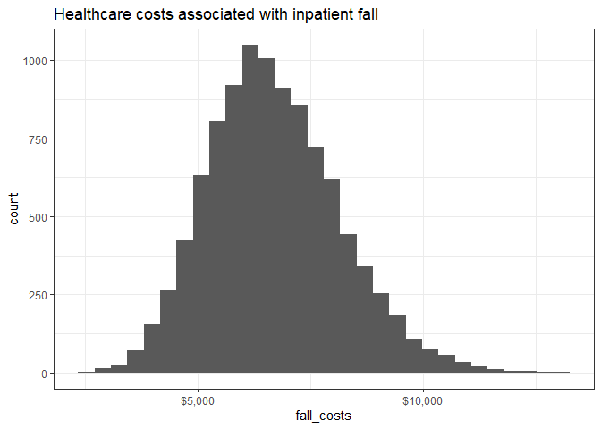
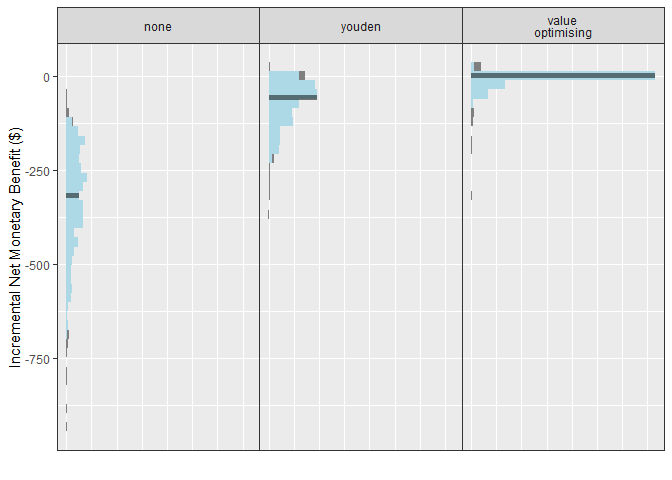
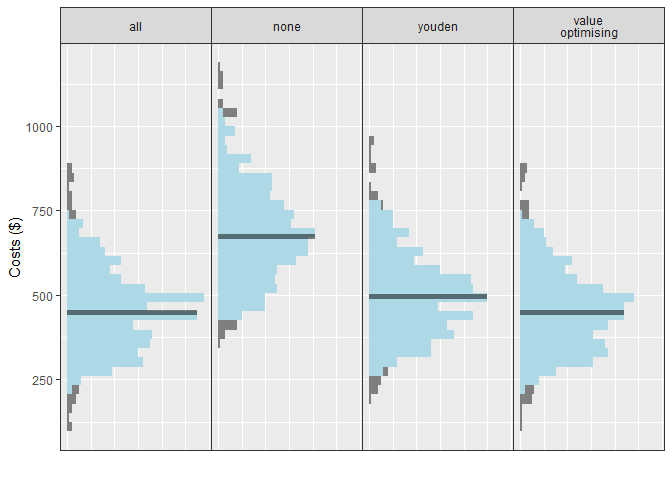
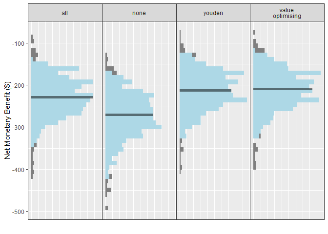
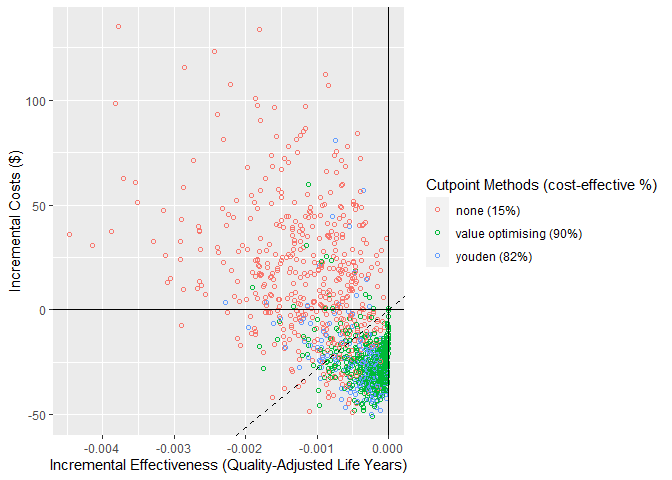

# predictNMB-demo
Rex Parsons

If you haven’t already, please install these packages

``` r
install.packages(c("predictNMB", "ggplot2", "purrr", "cowplot"))
```

``` r
library(predictNMB)
library(ggplot2)
library(purrr)
library(cowplot)
library(parallel)
```

## Example problem and inputs required - inpatient falls

- Falls leads to about 0.04 lost Quality-Adjusted Life Years (QALYs)
  (Latimer et al. 2013) and has an approximate beta distribution of:
  $$\mathrm{B}(\alpha = 2.95, \beta = 32.25)$$  

- There are also additional healthcare costs of about \$6669 (Morello et
  al. 2015) and follows an approximate gamma distribution of:
  $$\Gamma (\alpha = 22.05, \beta = 0.0033) $$

- Fall prevention education…

  - has a fixed, known cost of \$77.3 per patient (Hill et al. 2015)
  - reduces probability of fall by 45% (Haines et al. 2011) - the log
    hazard ratio follows an approximate normal distribution of:
    $$\mathcal{N}(\mu = -0.844, \sigma = 0.304) $$

- The willingness-to-pay (WTP) for us is \$28033 AUD

- Current practice: Everyone gets the fall prevention intervention
  (treat-all approach).

Calculations and code for using details in paper cited papers above is
described in (Parsons et al. 2023).

## Objectives/Questions

- We have a prediction model which has an AUC of about 0.8 and we want
  to know whether it’ll be worthwhile implementing it within a CDSS to
  reduce healthcare costs (giving people that are unlikely to fall the
  intervention at \$77.3 a pop!)

- We are currently in a geriatric ward where the fall rate is about 0.1
  (1 in 10 admitted patients have a fall) but are also interested in
  implementing the same model in the acute care ward (fall rate = 0.03).
  Would we expect to make the same conclusion?

- We think we can improve the performance of the model up to 0.95 with
  some extra effort by the models - would this change our conclusion?

## pre-`{predictNMB}` primer on the distributions we will be using.

We will be using different distributions to sample different inputs for
our simulation. A gamma distribution is often appropriate when sampling
\$ and a beta distribution is often best when sampling QALYs due to the
shape and limits being sensible (the cost of treatment is unlikely be to
be negative and QALYs are bounded to be between 0 and 1, similar to a
probability of an event). We can sample from these distributions using R
code with the `rgamma()` and `rbeta()` functions - for example, here are
the distributions above for the healthcare costs and the QALYs
associated with a fall:

``` r
data.frame(QALYs_lost = rbeta(10000, shape1 = 2.95, shape2 = 32.25)) |>
  ggplot(aes(x = QALYs_lost)) + 
  geom_histogram() +
  theme_bw()
```


``` r
data.frame(fall_costs = rgamma(10000, shape = 22.05, rate = 0.0033)) |>
  ggplot(aes(x = fall_costs)) + 
  geom_histogram() +
  theme_bw()
```



We will be using these sampling functions within our NMB sampling
functions!


## `{predictNMB}`

## Making our samplers

``` r
validation_sampler <- get_nmb_sampler(
  outcome_cost = function()  rgamma(1, shape = 22.05, rate = 0.0033),
  wtp = 28033,
  qalys_lost = function() rbeta(1, shape1 = 2.95, shape2 = 32.25),
  high_risk_group_treatment_effect = function() exp(rnorm(1, mean = -0.844, sd = 0.304)),
  high_risk_group_treatment_cost = 77.3,
  low_risk_group_treatment_effect = 0,
  low_risk_group_treatment_cost = 0,
  use_expected_values = FALSE
)


training_sampler <- get_nmb_sampler(
  outcome_cost = function()  rgamma(1, shape = 22.05, rate = 0.0033),
  wtp = 28033,
  qalys_lost = function() rbeta(1, shape1 = 2.95, shape2 = 32.25),
  high_risk_group_treatment_effect = function() exp(rnorm(1, mean = -0.844, sd = 0.304)),
  high_risk_group_treatment_cost = 77.3,
  low_risk_group_treatment_effect = 0,
  low_risk_group_treatment_cost = 0,
  use_expected_values = TRUE
)
```

## Primary analyses

### Running our simulation (primary use-case)

``` r
cl <- makeCluster(detectCores() - 1)

primary_sim <- do_nmb_sim(
  n_sims = 500,
  n_valid = 10000,
  sim_auc = 0.8,
  event_rate = 0.1,
  cutpoint_methods = get_inbuilt_cutpoint_methods(),
  fx_nmb_training = training_sampler,
  fx_nmb_evaluation = validation_sampler,
  show_progress = TRUE,
  cl = cl
)
```

### Interpreting our results

``` r
summary(primary_sim)
```

    # A tibble: 8 × 3
      method           median `95% CI`         
      <chr>             <dbl> <chr>            
    1 all               -581. -926.9 to -279.1 
    2 cost minimising   -582. -923.6 to -288.3 
    3 index of union    -653. -1025 to -357.3  
    4 none              -909. -1329.8 to -564.6
    5 prod sens spec    -659. -1045 to -350    
    6 roc01             -658. -1049.4 to -354  
    7 value optimising  -588. -937.4 to -292.5 
    8 youden            -659. -1050.3 to -342.9

``` r
autoplot(primary_sim) + theme_sim()
```


``` r
autoplot(primary_sim, what = "cutpoints") + theme_sim()
```


``` r
autoplot(primary_sim, what = "inb", inb_ref_col = "all") + theme_sim()
```



``` r
autoplot(primary_sim, what = "qalys") + theme_sim()
```


``` r
autoplot(primary_sim, what = "costs") + theme_sim()
```



``` r
ce_plot(primary_sim, ref_col = "all", methods_order = c("all", "none", "youden", "value optimising"))
```


## Acute care setting?

``` r
acute_care_sim <- do_nmb_sim(
  n_sims = 500,
  n_valid = 10000,
  sim_auc = 0.8,
  event_rate = 0.03,
  cutpoint_methods = get_inbuilt_cutpoint_methods(),
  fx_nmb_training = training_sampler,
  fx_nmb_evaluation = validation_sampler,
  show_progress = TRUE,
  cl = cl
)

summary(acute_care_sim)
```

    # A tibble: 8 × 3
      method           median `95% CI`        
      <chr>             <dbl> <chr>           
    1 all               -227. -339.7 to -139.3
    2 cost minimising   -206. -315.6 to -117.4
    3 index of union    -208. -322.8 to -120  
    4 none              -271. -409 to -168.2  
    5 prod sens spec    -211. -324.2 to -122.6
    6 roc01             -210. -324.2 to -121.9
    7 value optimising  -209. -321.3 to -120.2
    8 youden            -213. -324.2 to -124.1

``` r
summary(acute_care_sim, what = "cutpoints")
```

    # A tibble: 8 × 3
      method           median `95% CI`
      <chr>             <dbl> <chr>   
    1 all                0    0 to 0  
    2 cost minimising    0.02 0 to 0  
    3 index of union     0.04 0 to 0.1
    4 none               1    1 to 1  
    5 prod sens spec     0.04 0 to 0.1
    6 roc01              0.04 0 to 0.1
    7 value optimising   0.02 0 to 0.1
    8 youden             0.03 0 to 0.1

``` r
autoplot(acute_care_sim)
```



``` r
ce_plot(acute_care_sim, ref_col = "all", methods_order = c("all", "none", "youden", "value optimising"))
```



## What if we improve the model discrimination (AUC)?

``` r
auc_screen <- screen_simulation_inputs(
  n_sims = 500,
  n_valid = 10000,
  sim_auc = seq(0.8, 0.95, 0.05),
  event_rate = 0.1,
  cutpoint_methods = get_inbuilt_cutpoint_methods(),
  fx_nmb_training = training_sampler,
  fx_nmb_evaluation = validation_sampler,
  show_progress = TRUE,
  cl = cl
)
```

    Running simulation: [1/4]

    Running simulation: [2/4]

    Running simulation: [3/4]

    Running simulation: [4/4]

``` r
autoplot(auc_screen, methods_order = c("all", "none", "youden", "value optimising"), dodge_width = 0.01)
```

    No value for 'x_axis_var' given.

    Screening over sim_auc by default


``` r
map(1:4, \(x){
  ce_plot(auc_screen$simulations[[x]], ref_col = "all", methods_order = c("all", "none", "youden", "value optimising"))
}) |> 
  (\(x) {
    leg <- get_legend(x[[1]])
    new_plots <- map(x, function(x) x  + theme_bw() + theme(legend.position = "none") + xlab("Inc. Benefit (QALYs)")) 
    g <- plot_grid(plotlist = new_plots, ncol = 2, nrow = 2, labels = seq(0.8, 0.95, 0.05), label_y = 1.15) +
      theme(plot.margin = margin(1, 1, 1, 1, "cm"))
    plot_grid(g, leg, rel_widths = c(0.5, 0.1), nrow = 1) + theme(plot.margin = margin(r=1, unit="cm"))
  })()
```


# References

<div id="refs" class="references csl-bib-body hanging-indent">

<div id="ref-haines2011patient" class="csl-entry">

Haines, Terry P, Anne-Marie Hill, Keith D Hill, Steven McPhail, David
Oliver, Sandra Brauer, Tammy Hoffmann, and Christopher Beer. 2011.
“Patient Education to Prevent Falls Among Older Hospital Inpatients: A
Randomized Controlled Trial.” *Archives of Internal Medicine* 171 (6):
516–24.

</div>

<div id="ref-hill2015fall" class="csl-entry">

Hill, Anne-Marie, Steven M McPhail, Nicholas Waldron, Christopher
Etherton-Beer, Katharine Ingram, Leon Flicker, Max Bulsara, and Terry P
Haines. 2015. “Fall Rates in Hospital Rehabilitation Units After
Individualised Patient and Staff Education Programmes: A Pragmatic,
Stepped-Wedge, Cluster-Randomised Controlled Trial.” *The Lancet* 385
(9987): 2592–99.

</div>

<div id="ref-latimer13" class="csl-entry">

Latimer, Nicholas, Simon Dixon, Amy Kim Drahota, and Martin Severs.
2013. “<span class="nocase">Cost–utility analysis of a shock-absorbing
floor intervention to prevent injuries from falls in hospital wards for
older people</span>.” *Age and Ageing* 42 (5): 641–45.
<https://doi.org/10.1093/ageing/aft076>.

</div>

<div id="ref-morello2015extra" class="csl-entry">

Morello, Renata T, Anna L Barker, Jennifer J Watts, Terry Haines, Silva
S Zavarsek, Keith D Hill, Caroline Brand, et al. 2015. “The Extra
Resource Burden of in-Hospital Falls: A Cost of Falls Study.” *Medical
Journal of Australia* 203 (9): 367–67.

</div>

<div id="ref-parsons2023cutpoints" class="csl-entry">

Parsons, Rex, Robin Blythe, Susanna M Cramb, and Steven M McPhail. 2023.
“Integrating Economic Considerations into Cutpoint Selection May Help
Align Clinical Decision Support Toward Value-Based Healthcare.” *Journal
of the American Medical Informatics Association*, March.
<https://doi.org/10.1093/jamia/ocad042>.

</div>

</div>
